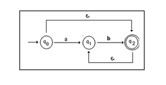

# Autômato Finito Não Determinístico com Movimentos Vazios (AFNe)
 
</p>


## Descrição do Projeto
- Este projeto teve como base a implementação do Autômato Finito Não Determinístico com Movimentos Vazios (AFNe), contendo no AFe.py as funções de fecho vazio e verificação da palavra aceita.

- Um movimento vazio é uma transição sem leitura da fita. No AFNe a palavra é <i>aceita</i> quando após a leitura de toda a palavra o AFNe assume um estado final por no mínimo um dos caminhos, enquanto ela é <i>rejeitada</i> se não assumir nenhum estado final depois de ler toda a palavra, ou se a função programa não estiver definida para os argumentos.

- A função fecho vazio é o conjuto de todos os estados a partir de um estado <i>q</i> com apenas transições vazias.

## Teste
- Dado o seguinte automâto
<p align="center">
  

- Foi realizado o cálculo para a busca do fecho com as seguintes entradas:<br>
obs: Foi considerado `&` como transição vazia
```
### Criando AFNe ###

Digite até 3 símbolos do alfabeto separados por vírgula: a,b
Digite até 5 estados separados por vírgula: 0,1,2
Digite o estado inicial: 0
Digite uma transição. Considere & como epsilon. Digite 'sair' para finalizar: 0a1
Digite uma transição. Considere & como epsilon. Digite 'sair' para finalizar: 0&2
Digite uma transição. Considere & como epsilon. Digite 'sair' para finalizar: 1b2
Digite uma transição. Considere & como epsilon. Digite 'sair' para finalizar: 2&1
Digite uma transição. Considere & como epsilon. Digite 'sair' para finalizar: sair
Digite os estados finais separados por vírgula: 2
```
- O resultado da entrada é mostrada a seguir:
```
### AFNe criado ###
Σ (alfabeto): {'b', 'a'}
Q (estados): {0, 1, 2}
δ: (função programa): {(0, 'a'): {1}, (0, '&'): {2}, (1, 'b'): {2}, (2, '&'): {1}}
q0: (estado inicial): 0
F: (estados finais): {2}

### Calculando Fecho Vazio ###
O fecho vazio do estado 0 é: {0, 1, 2}
O fecho vazio do estado 1 é: {1}
O fecho vazio do estado 2 é: {1, 2}
```
- Duas palavra foram testadas para pra verificação da aceitação:<br>
obs: Foi considerado `true` para aceitação e `false` para rejeição da palavra
```
### Testes ###

Testando palavras. Digite 'sair' para finalizar:

>>> abb
Palavra 'abb': True
>>> bbb
Palavra 'bbb': True
```

## Colaboradores
<table>
  <tr>
    <td align="center" style="border: none;">
      <a href="https://github.com/lomaferreira" style="text-decoration: none;">
        <br>
        <sub><b>Paloma Santos</b></sub>
      </a>
    </td>
    <td align="center" style="border: none;">
      <a href="https://github.com/amandaac17" style="text-decoration: none;">
        <br>
        <sub><b>Amanda Cardoso</b></sub>
      </a>
    </td>
  </tr>
</table>

